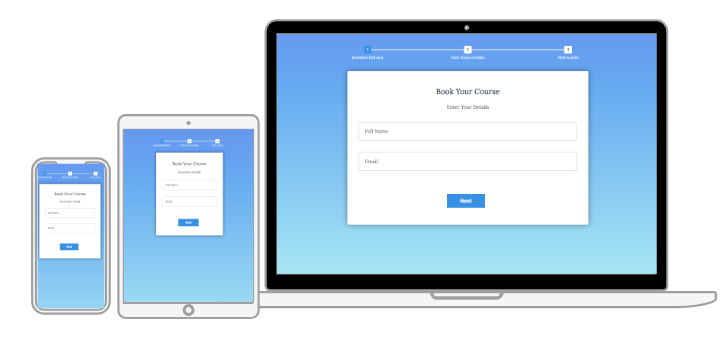
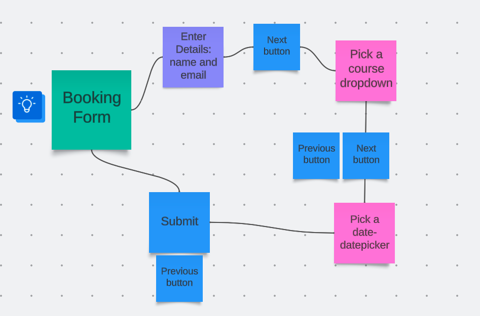
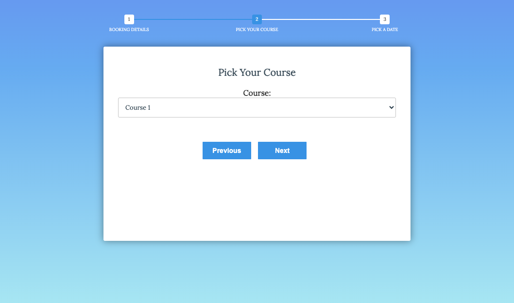
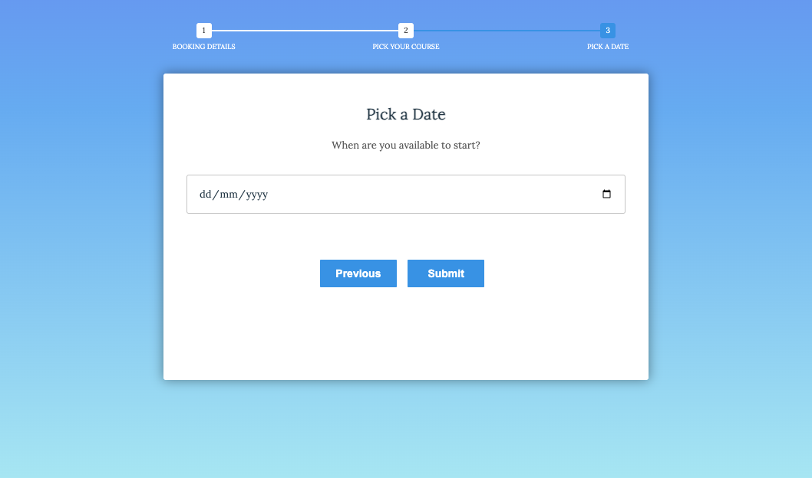
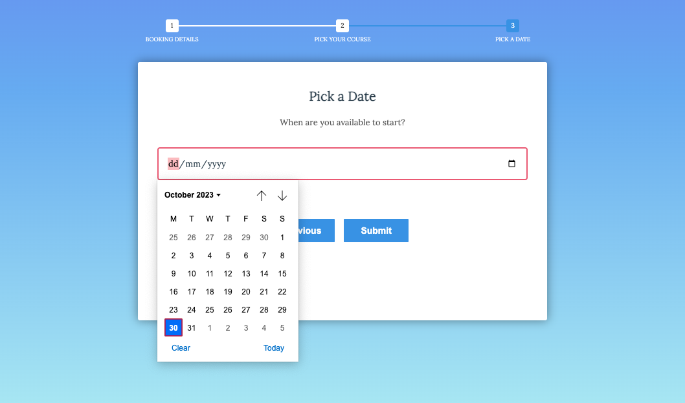

# **_Booking Course Form_**

<a href="https://mihayounas.github.io/ryalto-challenge-booking/" target="_blank" rel="noopener">Booking Your Course Form</a>(press for Live DEMO) is a website designed as a multi-step booking form.

# Flowchart

## Design
* ### Font 
The fonts chosen were 'Lora' and 'Monteserrat'  The two fonts chosen go really good together and it provides really good contrast .

* ### Colour Scheme
 The color scheme chosen is based on a white,light blue and blue gradient .The colors are consistent throughout the website .

 

 # Features
Booking Form website is set up to be easy to use . It contains features that a user would be fimiliar with ,such as navigation buttons and form fields .

Pick a course fieldset is a dropdown of a list of courses.

Pick a date fieldset is a datepicker. 

# Technologies Used
* [HTML5](https://www.w3schools.com/html/) - provides the content and structure for the website.
* [CSS](https://www.w3.org/Style/CSS/Overview.en.html) - provides the styling.
* [JavaScript](https://www.w3schools.com/js/)-provides interactivity.
* [Github](https://github.com/) - used to host and edit the website.

## Browser Compatibility

Booking Form site was tested on the following browsers with no visible issues for the user:
1. Google Chrome 
2. Safari 
3. Mozilla Firefox
* Appearance, functionality and responsiveness were consistent throughout for a range of browsers and device sizes.

### Content

* The font came from [Google Fonts](https://fonts.google.com/).
* The colour scheme was made by [Coolors](https://coolors.co/).
* Moqup was done on [Moqups](https://app.moqups.com/).
* Flowchart schetch [Lucidchart](https://lucid.app/)
* Design in [Canva](https://www.canva.com/)

Mihaela Younas 2023.